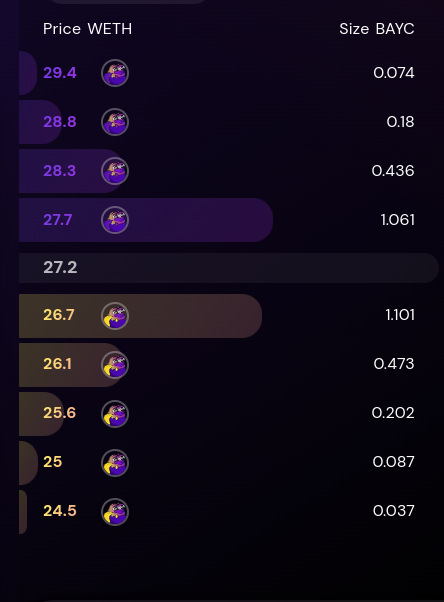

# NFTPerp Market Maker

This repository is a script for market making in the NFTPerp Platform.

## Working Mechanism
This repository creates limit orders on both sides of all pairs of the NFTPerp limit order book. On first execution, orders summing to TARGET_ETH in the skew defined by SKEWNESS are created.

Then, orders are constantly monitored. Orders are updated when the bids price deviates above the mark/index price at a rate of BID_UPDATE_GAP %, or the sum of open orders deviates at a size greater than DEVIATION_THRESHOLD. If there is an active long exposure, the new orders will be larger on the short side and vice versa.

- The DEVIATION_THRESHOLD check exists because it would be expensive to actively create transactions and change orders after every trade. 

- The exposure check exists to limit risk and because the platform has a maximum open position limit.

**Configuration:**

The configuration defined in config.json defines the following parameters:

- TARGET_ETH: Determines the targeted max amount to make in each side of the book

- SKEWNESS: A parameter that determines how skewed the orders are towards the mark price

- ORDER_COUNT: Specifies the number of orders placed on each side of the market.

- SPREAD: Determines the distance between the market price and placed orders.

- SLEEP_TIME: Sets the delay between actions to avoid nonce errors.

- SIZE_MULTIPLIER: Determines the amount to reduce one side of the orders by when there is an open position 

- DEVIATION_THRESHOLD: The deviation above which we modify the open orders

- BID_UPDATE_GAP: The deviation betwen the mark/index and the order price, above which the orders are updated

# LiveTrader
liveTrader.js is a library that streamlines the process of trading on the NFTPerp Platform. It is to be instanciated using the following constructor:

    constructor(signer, amm, leverage=1, testnet = true)

**Parameters:**

    signer: An Ethereum signer.
    amm: Denotes the chosen market.
    leverage: The leverage trader is willing to use, with a default of 1.
    testnet: A boolean flag indicating if the system operates in testnet mode (default is true).

It contains the following method:

**1. initialize()**

Sets up contract addresses and initializes the ClearingHouse contract.

    Parameters: None.
    Return: void.

**2. getPrice()**

Fetches the current mark price for the chosen market.

    Parameters: None.
    Return: float - representing the markPrice.

**3. getIndexPrice()**

Fetches the current index price for the selected market.

    Parameters: None.
    Return: float - representing the indexPrice.

**4. getPosition()**

Retrieves the trader's position in the given market

    Parameters: None.
    Return: Object representing the trader's position

**5. getPositionSize()**

Retrieves the size of the trader's position at the market price.

    Parameters: None.
    Return: float - representing the position size.

**6. getBalance()**

Obtains the WETH balance associated with the trader's address

    Parameters: None.
    Return: float  - balance in ETH format.

**7. getETHBalance()**

Queries the Ethereum balance of the trader's address

    Parameters: None.
    Return: float - balance in ETH format.

**8. cancelAllLimitOrders()**

Cancels all of the trader's limit orders in the chosen market

    Parameters: None.
    Return: void

**9. createLimitOrder(side, price, amount)**

Sets up a limit order based on the provided criteria.

    Parameters: 
        side: String ("LONG" or "SHORT") to indicate order direction.
        price: Numeric value for the desired order price.
        amount: Numeric value for the order amount.
    
    Return: Transaction object.

**10. updateLimitOrder(id, side, price, amount)**

Modifies an existing limit order based on its ID and provided parameters.

    Parameters: 
        id: Order ID to be updated.
        side: String ("LONG" or "SHORT") to indicate order direction.
        price: Numeric value for the desired order price.
        amount: Numeric value for the order amount.
    
    Return: Transaction object.

**11. cancelLimitOrder(side, price)**

Cancels a specified limit order based on its side and price.

    Parameters: 
        side: String indicating order side.
        price: Numeric value indicating order price.

    Return: Transaction object

**12. cancelOrder(orderId)**

Cancels a specified limit order based on its id

    Parameters: 
        orderId: ID of the order to be canceled.

    Return: Transaction object

**13. sumBuyAndSellOrders()**

Aggregates the value of all of the trader's buy and sell orders.

    Parameters: None.
    Return: Object with properties buySum and sellSum indicating the totals.

**14. getMyOrders()**

Fetches the trader's orderbook, segmented into buy and sell orders.

    Parameters: None.
    Return: Object containing arrays buyOrders and sellOrders, sorted by price.

**15. getOrders()**

Retrieves the entire orderbook, segmented into buy and sell orders.

    Parameters: None.
    Return: Object containing arrays buyOrders and sellOrders, sorted by price.
